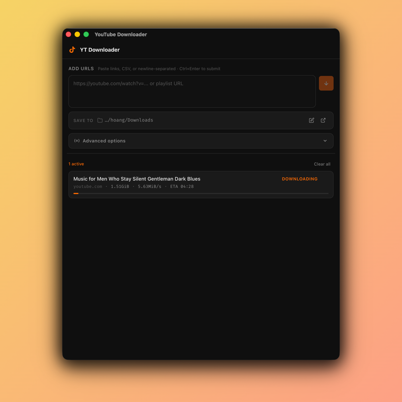

<div align="center">


# Lumi Downloader

**A fast, minimal desktop app for downloading videos and playlists.**
Built with [Tauri v2](https://tauri.app/) (Rust) + [Svelte 5](https://svelte.dev/).

[](https://github.com/hoangqnguyen/lumi-downloader/releases)
[](LICENSE)
[](#download)

<br/>



<br/>

**[⬇️ Download](https://github.com/hoangqnguyen/lumi-downloader/releases/latest)** · **[Report a bug](https://github.com/hoangqnguyen/lumi-downloader/issues)** · **[Donate ☕](#donate)**

</div>

---

## Features

- Paste a list of URLs (newline, comma, or space-separated) or a playlist URL
- Playlist URLs are automatically expanded into individual videos
- Parallel downloads with configurable concurrency (1–5 at a time)
- Real-time progress per video: speed, ETA, file size
- Customizable save folder (defaults to system Downloads)
- Audio-only mode: extract MP3 from any video
- Resolution selector: Best / 1080p / 720p / 480p / 360p
- Browser cookie passthrough to handle age-gated or members-only content
- Light/dark theme toggle, small binary (~5 MB), no telemetry, no ads

---

## Download

Head to the [Releases page](https://github.com/hoangqnguyen/lumi-downloader/releases/latest) and grab the file for your platform:

| Platform | File |
|----------|------|
| macOS (Apple Silicon + Intel) | `Lumi.Downloader_universal.dmg` |
| Windows | `Lumi.Downloader_x64_en-US.msi` or `.exe` |
| Linux | `.AppImage`, `.deb`, or `.rpm` |

> **macOS note:** The app is notarized and signed — you can open it normally. If you see a security warning anyway, right-click → Open.

---

## Build from source

### Prerequisites

| Tool | Version |
|------|---------|
| [Rust](https://rustup.rs/) | ≥ 1.77 |
| [Node.js](https://nodejs.org/) | ≥ 18 |

### Quick start

```bash
# 1. Clone
git clone https://github.com/hoangqnguyen/lumi-downloader
cd lumi-downloader

# 2. Install JS dependencies
npm install

# 3. Download sidecar binaries (see platform sections below)
#    Place them in src-tauri/binaries/

# 4. Dev mode
npm run tauri -- dev

# 5. Release build
npm run tauri -- build
```

### macOS — sidecar binaries

```bash
mkdir -p src-tauri/binaries

# yt-dlp universal binary (Apple Silicon + Intel, Python 3.12 embedded)
curl -L "https://github.com/yt-dlp/yt-dlp/releases/latest/download/yt-dlp_macos" \
  -o src-tauri/binaries/yt-dlp-aarch64-apple-darwin
cp src-tauri/binaries/yt-dlp-aarch64-apple-darwin \
   src-tauri/binaries/yt-dlp-x86_64-apple-darwin

# ffmpeg + ffprobe — Apple Silicon
curl -L "https://www.osxexperts.net/ffmpeg80arm.zip" -o /tmp/ffmpeg-arm.zip
curl -L "https://www.osxexperts.net/ffprobe80arm.zip" -o /tmp/ffprobe-arm.zip
unzip -o /tmp/ffmpeg-arm.zip -d /tmp/
unzip -o /tmp/ffprobe-arm.zip -d /tmp/
cp /tmp/ffmpeg src-tauri/binaries/ffmpeg-aarch64-apple-darwin
cp /tmp/ffprobe src-tauri/binaries/ffprobe-aarch64-apple-darwin

# ffmpeg + ffprobe — Intel
curl -L "https://evermeet.cx/ffmpeg/getrelease/ffmpeg/zip" -o /tmp/ffmpeg-x64.zip
curl -L "https://evermeet.cx/ffmpeg/getrelease/ffprobe/zip" -o /tmp/ffprobe-x64.zip
unzip -o /tmp/ffmpeg-x64.zip -d /tmp/
unzip -o /tmp/ffprobe-x64.zip -d /tmp/
cp /tmp/ffmpeg src-tauri/binaries/ffmpeg-x86_64-apple-darwin
cp /tmp/ffprobe src-tauri/binaries/ffprobe-x86_64-apple-darwin

chmod +x src-tauri/binaries/yt-dlp-* src-tauri/binaries/ffmpeg-*
```

**Universal binary** (runs natively on both Apple Silicon and Intel):

```bash
rustup target add aarch64-apple-darwin x86_64-apple-darwin
npm run tauri -- build --target universal-apple-darwin
```

### macOS — notarization (for distributing outside App Store)

To avoid Gatekeeper warnings when distributing the `.dmg`, sign and notarize with your Apple Developer account:

```bash
# 1. Set environment variables
export APPLE_ID="you@example.com"
export APPLE_PASSWORD="xxxx-xxxx-xxxx-xxxx"   # App-specific password
export APPLE_TEAM_ID="XXXXXXXXXX"
export APPLE_SIGNING_IDENTITY="Developer ID Application: Your Name (XXXXXXXXXX)"

# 2. Build + notarize in one step (Tauri handles stapling automatically)
npm run tauri -- build --target universal-apple-darwin
```

Add the following to `src-tauri/tauri.conf.json` under `bundle.macOS` to enable signing:

```json
"macOS": {
  "signingIdentity": "Developer ID Application: Your Name (XXXXXXXXXX)",
  "minimumSystemVersion": "10.15"
}
```

### Windows — sidecar binaries

```powershell
# yt-dlp
Invoke-WebRequest "https://github.com/yt-dlp/yt-dlp/releases/latest/download/yt-dlp.exe" `
  -OutFile "src-tauri\binaries\yt-dlp-x86_64-pc-windows-msvc.exe"

# ffmpeg + ffprobe
Invoke-WebRequest "https://github.com/BtbN/FFmpeg-Builds/releases/latest/download/ffmpeg-master-latest-win64-gpl.zip" `
  -OutFile "$env:TEMP\ffmpeg.zip"
Expand-Archive "$env:TEMP\ffmpeg.zip" -DestinationPath "$env:TEMP\ffmpeg-extract" -Force
$ffmpegExe = Get-ChildItem "$env:TEMP\ffmpeg-extract" -Recurse -Filter "ffmpeg.exe" | Select-Object -First 1
$ffprobeExe = Get-ChildItem "$env:TEMP\ffmpeg-extract" -Recurse -Filter "ffprobe.exe" | Select-Object -First 1
Copy-Item $ffmpegExe.FullName "src-tauri\binaries\ffmpeg-x86_64-pc-windows-msvc.exe"
Copy-Item $ffprobeExe.FullName "src-tauri\binaries\ffprobe-x86_64-pc-windows-msvc.exe"
```

### Linux — sidecar binaries

```bash
pip install -U yt-dlp
cp $(which yt-dlp) src-tauri/binaries/yt-dlp-x86_64-unknown-linux-gnu
chmod +x src-tauri/binaries/yt-dlp-x86_64-unknown-linux-gnu

sudo apt install ffmpeg
cp $(which ffmpeg) src-tauri/binaries/ffmpeg-x86_64-unknown-linux-gnu
cp $(which ffprobe) src-tauri/binaries/ffprobe-x86_64-unknown-linux-gnu
chmod +x src-tauri/binaries/ffmpeg-x86_64-unknown-linux-gnu src-tauri/binaries/ffprobe-x86_64-unknown-linux-gnu
```

Additional system dependencies (Linux)

Building the Tauri app on Linux requires development libraries for GTK / WebKit and other build tools. On Debian/Ubuntu (and Pop!_OS) install:

```bash
sudo apt update
sudo apt install -y build-essential pkg-config cmake libglib2.0-dev libgdk-pixbuf2.0-dev \
  libwebkit2gtk-4.1-dev libsoup-3.0-dev libssl-dev squashfs-tools patchelf
```

On Fedora/RHEL use the equivalent packages (example):

```bash
sudo dnf install -y @development-tools pkgconfig cmake glib2-devel gdk-pixbuf2-devel \
  webkit2gtk4.1-devel libsoup3-devel openssl-devel squashfs-tools patchelf
```

Notes:
- Ensure `pkg-config` can find `libsoup-3.0.pc` and other .pc files (set `PKG_CONFIG_PATH` if you installed libraries to a custom location).
- AppImage bundling requires `mksquashfs` (from `squashfs-tools`) and `patchelf`. If AppImage creation fails, check those tools and whether `/tmp` is mounted with `noexec` (this can prevent the linuxdeploy AppImage from running).


---

## Sidecar naming reference

Tauri requires bundled binaries to follow the `{name}-{rust-target-triple}` naming convention.

| Platform | yt-dlp | ffmpeg | ffprobe |
|----------|--------|--------|---------|
| macOS Apple Silicon | `yt-dlp-aarch64-apple-darwin` | `ffmpeg-aarch64-apple-darwin` | `ffprobe-aarch64-apple-darwin` |
| macOS Intel | `yt-dlp-x86_64-apple-darwin` | `ffmpeg-x86_64-apple-darwin` | `ffprobe-x86_64-apple-darwin` |
| Windows (MSVC) | `yt-dlp-x86_64-pc-windows-msvc.exe` | `ffmpeg-x86_64-pc-windows-msvc.exe` | `ffprobe-x86_64-pc-windows-msvc.exe` |
| Linux x64 | `yt-dlp-x86_64-unknown-linux-gnu` | `ffmpeg-x86_64-unknown-linux-gnu` | `ffprobe-x86_64-unknown-linux-gnu` |

To find your exact triple: `rustc -vV | grep host`

---

## Project structure

```
lumi-downloader/
├── src/                        # Svelte 5 frontend
│   ├── App.svelte
│   ├── app.css                 # Global styles + theme variables
│   ├── main.ts
│   └── lib/
│       ├── components/
│       │   ├── UrlInput.svelte
│       │   ├── QueuePanel.svelte
│       │   ├── QueueItem.svelte
│       │   ├── AdvancedPanel.svelte
│       │   └── FolderPicker.svelte
│       ├── stores/
│       │   ├── queue.svelte.ts     # Download queue state + scheduler
│       │   └── settings.svelte.ts  # Persistent settings (folder, quality)
│       ├── tauri.ts                # Typed wrappers for Tauri commands
│       ├── parseUrls.ts            # URL parsing and playlist detection
│       └── types.ts
├── src-tauri/                  # Rust / Tauri backend
│   ├── src/
│   │   ├── lib.rs              # Plugin registration + AppState
│   │   ├── commands/
│   │   │   ├── download.rs     # start_download, cancel_download
│   │   │   ├── playlist.rs     # expand_playlist
│   │   │   └── settings.rs     # pick_folder, open_folder
│   │   └── ytdlp/
│   │       ├── runner.rs       # yt-dlp sidecar spawn + stdout streaming
│   │       └── progress.rs     # Progress line parser
│   ├── binaries/               # Sidecar binaries (gitignored)
│   ├── capabilities/default.json
│   └── tauri.conf.json
├── package.json
└── vite.config.ts
```

---

## Troubleshooting

**`error: could not find yt-dlp sidecar`** — Binary missing or misnamed. Check `src-tauri/binaries/` for the exact triple suffix.

**`Permission denied` on sidecar** (macOS/Linux) — Run `chmod +x src-tauri/binaries/yt-dlp-* src-tauri/binaries/ffmpeg-* src-tauri/binaries/ffprobe-*`.

**Downloads fail with ffmpeg error** — Make sure `src-tauri/binaries/ffmpeg-{triple}` exists and is executable.

**`webkit2gtk not found`** (Linux) — Install the system WebKit package for your distro (see Linux setup above).

**Gatekeeper warning on macOS** — Either notarize the build (see above), or right-click → Open on first launch.

---

## Donate

Lumi Downloader is free and open source. If it saves you time, consider buying me a coffee ☕

[](https://buymeacoffee.com/hoangqnguyen)
[](https://github.com/sponsors/hoangqnguyen)

---

## License

MIT — see [LICENSE](LICENSE).
